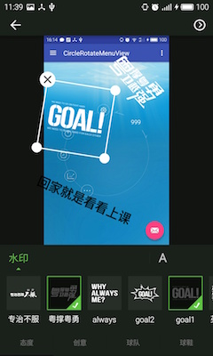
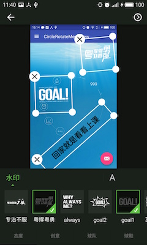

# StickView
  图片标签处理
  
## Screenshots
   

##Feature

- 支持缩放(最小缩放),平移,并生成处理后的图片.
- 支持便签数量无限制(较多可能存在性能问题)
- 支持文字标签(实质文字转换成图片)

##Issue
- StickView scaleType must be fitCenter,cause compose bitmap base only fitCenter scaleType.
- 卡顿问题,对比其他相同标签图片lib,本库流畅度明显比较差.(需查出并更正)
- 锯齿问题,图片生成会出现锯齿(需查出并更正)

## Similar results are found: (recommend the following lib)
- sangmingming:https://github.com/sangmingming/StickerView.git
- Skykai521:https://github.com/Skykai521/StickerCamera.git


## Copyright

**涉及到公司版权的问题:我只将library提交(界面,素材,元素并未加入),实际例子可以下面链接下载任议球,该app已下架,服务已停止运行.经得同意再提交吧.**
[任议球](https://www.baidu.com/s?ie=utf-8&f=8&rsv_bp=1&tn=98050039_pg&wd=%E4%BB%BB%E8%AE%AE%E7%90%83&oq=java%20%E5%AF%B9%E8%B1%A1%E6%AF%94%E8%BE%83&rsv_pq=cc28df32003702ce&rsv_t=168cyIApnf1rJBexyw4USjXqFakiQq3ijA6mUQYyYQ65aFs49O4oxr1ozVteiZpvEds&rsv_enter=1&rsv_sug3=12&rsv_sug1=10&rsv_sug7=100&rsv_sug2=0&inputT=10958&rsv_sug4=10958)


## sample 本地标签的实现方案
**app需初始化一批标签在本地,具体的做法是:**

- 将标签图片以目录文件的形式存放在assets中的water目录下(其中每个category为一个目录).
  将含有标签图片分组信息的数据库waterMark.db存放在assets根目录下(具体信息有分组,id,categoryId,名字,url)
- 程序启动时将assets中water目录整体拷贝到sdcard指定目录,以便后面读取.
- 初始化标签布局页面时,读取.../packageName/data/database/waterMark.db(不存在,则从assets拷贝)相关信息初始.


## Gradle

```groovy
compile 'com.yovenny.StickView:sticklib:1.0.0'
```

##Usage
    
###＊incode＊
```java  
   mSticker.outsideRadium(14).insideRadium(9).stickWidth(150).strokeWidth(2);
                      
```
                      
###  ＊in xml＊
```xml
       <com.yovenny.sticklib.StickerSeriesView
                  android:background="#131413"
                  android:scaleType="fitCenter"
                  android:id="@+id/process_sticker"
                  android:layout_width="match_parent"
                  android:layout_height="match_parent" />
```

## About me
- email:1312397605@qq.com

